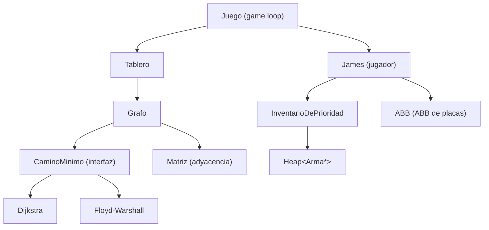

<p align="right">
  <a href="README.md">🇺🇸 English</a> | <strong>🇦🇷 Español</strong>
</p>

# Pathfinding con Grafos en C++ — Dijkstra, Floyd-Warshall e Inventario con Prioridad

<div align="center">


</div>

---

Proyecto en C++ que implementa **Dijkstra** y **Floyd-Warshall** desde cero sobre un **grafo dirigido con pesos**, usando esos algoritmos para resolver el pathfinding de un juego de terminal. El grafo está respaldado por una matriz de adyacencia escrita a mano, la cola de prioridad por un heap binario genérico, y el manejo de ítems por un árbol binario de búsqueda: nada delegado a los contenedores de la biblioteca estándar.

> Proyecto académico - FIUBA (2023 Q2).

---

## Pathfinding

`Grafo` guarda el algoritmo activo detrás de un puntero `CaminoMinimo*`. Cambiar de algoritmo es una sola línea:

```cpp
grafo.usar_floyd();   // o grafo.usar_dijkstra()
auto [camino, costo] = grafo.obtener_camino_minimo(origen, destino);
```

### Dijkstra

**Camino mínimo de fuente única** sobre una matriz de adyacencia V×V. Reserva tres arreglos en memoria dinámica (`vertices_visitados`, `distancia`, `recorrido`), selecciona el vértice no visitado con menor distancia mediante **búsqueda lineal**, relaja aristas y reconstruye el camino recorriendo el arreglo de predecesores desde el destino hacia el origen.

### Floyd-Warshall

**Camino mínimo entre todos los pares** con dos matrices (costo y siguiente salto). El triple ciclo corre únicamente cuando el grafo cambió (flag `hay_cambios`); cualquier consulta sobre un grafo sin modificaciones **reutiliza el resultado cacheado**.

### Ruteo sin Armas

Cuando el jugador no tiene armas, los enemigos son infranqueables. La lógica copia el tablero, desconecta los vértices ocupados por enemigos y luego **desconecta iterativamente las casillas penalizadas por adyacencia** (costo 50 vs 10) hasta que no exista un camino más barato — sin modificar el algoritmo subyacente.

---

## Estructuras de Datos

- **`Heap<T, comp>`**: heap binario genérico parametrizado en tipo y puntero a función comparadora. Respalda el inventario de armas. `alta` hace upheap, `baja` reemplaza la raíz con el último elemento y hace downheap. **El constructor de copia está eliminado.**
- **`ABB<T, menor, igual>`**: árbol binario de búsqueda template completamente recursivo, con alta, baja (**sucesor inorder** en el caso de dos hijos), consulta, recorridos DFS (inorder/preorder/postorder), BFS y altura. Almacena los ítems del jugador ordenados por ID.
- **`Matriz`**: arreglo plano de `int*` con **semántica de copia manual** y `expandir()` para crecer en una fila y columna en tiempo de ejecución.
- **`InventarioDePrioridad`**: wrapper delgado sobre `Heap<Arma*, Arma::mayor>` que expone `baja_arma_fuerte()` y `baja_arma_debil()`. La extracción del arma más débil requiere un **recorrido completo** ya que un max-heap no da acceso O(1) a su mínimo.

---

## Arquitectura



---

## Detalles Técnicos

| Propiedad | Valor |
|---|---|
| Lenguaje | C++17 |
| Build | CMake 3.22 o `g++ -I include src/*.cpp main.cpp -o main` |
| Tests | GoogleTest / GoogleMock |
| Grafo | Dirigido con pesos, matriz de adyacencia plana en `int*` |
| Algoritmos | Dijkstra (fuente única), Floyd-Warshall (todos los pares, cacheado) |
| Cola de prioridad | `Heap<T, comp>` — template propio |
| Almacenamiento de ítems | `ABB<T, menor, igual>` — template propio |
| Tablero | Grilla 9×9 desde CSV, modelada como grafo de 81 vértices |
| Penalización por adyacencia | 50 por paso cerca de enemigos vs. 10 en otro caso |

---

## Compilación y Ejecución

```bash
# Compilación directa
g++ -I include src/*.cpp main.cpp -o main -Wall -Werror -Wconversion && ./main

# O con CMake
cmake -B build && cmake --build build && ./main
```

Los tests están en `tests/` con su propio `CMakeLists.txt`. GoogleTest está incluido en `tests/gtest_lib/`.

---

## Gameplay

El jugador (`J`) recorre una grilla de 9×9 en la terminal desde la esquina inferior izquierda (`I`) hasta la superior derecha (`F`) a lo largo de **5 niveles**. Cada paso cuesta 10; las casillas adyacentes a enemigos cuestan 50. Caminar sobre un enemigo sin arma está bloqueado; con una equipada, el enemigo es eliminado y el arma se pierde. Completar un nivel agrega un ítem al ABB; **su altura determina el layout CSV del siguiente nivel**.

| Tecla | Acción |
|---|---|
| `w / s / a / d` | Moverse |
| `e / q / r` | Equipar arma más fuerte / más débil / desequipar |
| `f` | Mostrar/ocultar overlay del camino mínimo |
| `z` | Imprimir el camino óptimo desde el inicio |
| `x` | Completar el nivel automáticamente |

---

## Limitaciones

- Dijkstra usa **búsqueda lineal** para el mínimo (O(V) por paso) en lugar de una cola de prioridad con heap.
- La invalidación del caché de Floyd-Warshall es gruesa: **cualquier mutación del grafo** dispara una recomputación completa O(V³).
- La penalización por adyacencia se aplica como ajuste de costo en post-proceso, no como modificación de las aristas, por lo que el algoritmo en sí no la conoce.
- El tamaño del tablero está **fijo en tiempo de compilación** (`Tablero::MAXIMO_TAMANIO_TABLERO = 81`).
