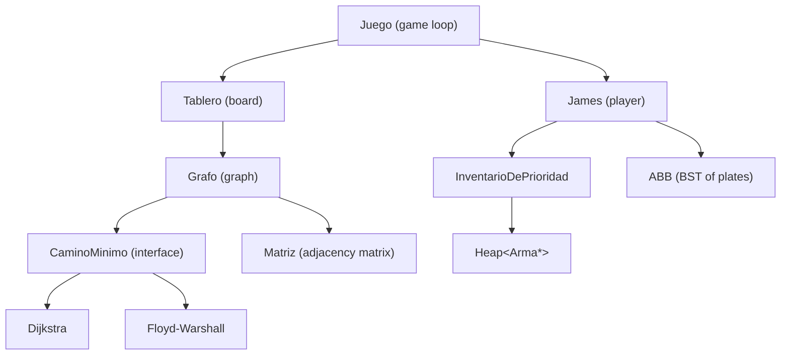

<p align="right">
  <strong>🇺🇸 English</strong> | <a href="README.es.md">🇦🇷 Español</a>
</p>

# Graph-Based Pathfinding in C++ — Dijkstra, Floyd-Warshall, and Priority-Aware Inventory

<div align="center">


</div>

---

A C++ project implementing **Dijkstra** and **Floyd-Warshall** from scratch over a **weighted directed graph**, driving pathfinding in a terminal-based game. The graph is backed by a hand-written adjacency matrix, the priority queue by a generic binary heap, and item management by a binary search tree: none of it delegated to the standard library.

> Academic project - FIUBA (2023 Q2).

---

## Pathfinding

`Grafo` stores the active algorithm behind a `CaminoMinimo*`. Switching is a one-liner:

```cpp
grafo.usar_floyd();   // or grafo.usar_dijkstra()
auto [path, cost] = grafo.obtener_camino_minimo(origen, destino);
```

### Dijkstra

**Single-source shortest path** over a V×V adjacency matrix. Allocates three raw arrays (`vertices_visitados`, `distancia`, `recorrido`), selects the minimum-distance unvisited vertex via **linear scan**, relaxes edges, and reconstructs the path by walking the predecessor array from destination back to source.

### Floyd-Warshall

**All-pairs shortest path** with two matrices (cost and next-hop). The triple loop runs only when the graph has changed (`hay_cambios` flag); any call on an unmodified graph **reuses the cached result**.

### Obstacle-Aware Routing

When the player has no weapons, enemies are impassable. The routing logic copies the board, disconnects enemy-occupied vertices, then **iteratively disconnects adjacency-penalized cells** (which carry a 50 vs 10 cost penalty) until no cheaper path exists — without modifying the underlying algorithm.

---

## Data Structures

- **`Heap<T, comp>`**: generic binary heap parameterized on type and comparator function pointer. Backs the weapon inventory. `alta` upheaps, `baja` replaces root with last element and downheaps. **Copy construction is deleted.**
- **`ABB<T, menor, igual>`**: fully recursive template BST with insert, remove (**in-order successor** for two-child case), search, DFS traversals (inorder/preorder/postorder), BFS, and height. Stores the player's collected items ordered by ID.
- **`Matriz`**: flat `int*` adjacency matrix with **manual copy semantics** and `expandir()` to grow by one row and column at runtime.
- **`InventarioDePrioridad`**: thin wrapper over `Heap<Arma*, Arma::mayor>` exposing `baja_arma_fuerte()` and `baja_arma_debil()`. The weak-weapon extraction requires a **full traversal** since a max-heap doesn't give O(1) access to its minimum.

---

## Architecture



---

## Technical Details

| Property | Value |
|---|---|
| Language | C++17 |
| Build | CMake 3.22 or `g++ -I include src/*.cpp main.cpp -o main` |
| Tests | GoogleTest / GoogleMock |
| Graph | Weighted directed, flat `int*` adjacency matrix |
| Algorithms | Dijkstra (single-source), Floyd-Warshall (all-pairs, cached) |
| Priority queue | `Heap<T, comp>` — custom template |
| Item storage | `ABB<T, menor, igual>` — custom template |
| Board | 9×9 grid from CSV, modeled as 81-vertex graph |
| Adjacency penalty | 50 per step near enemies vs. 10 otherwise |

---

## Build and Run

```bash
# Compile directly
g++ -I include src/*.cpp main.cpp -o main -Wall -Werror -Wconversion && ./main

# Or with CMake
cmake -B build && cmake --build build && ./main
```

Tests live under `tests/` with their own `CMakeLists.txt`. GoogleTest is included under `tests/gtest_lib/`.

---

## Gameplay

The player (`J`) navigates from the bottom-left (`I`) to the top-right (`F`) of a 9×9 terminal grid across **5 levels**. Each step costs 10; cells adjacent to enemies cost 50. Walking into an enemy without a weapon is blocked; with one equipped, the enemy is cleared and the weapon is lost. Completing a level adds an item to the BST; **its height selects the next CSV layout**.

| Key | Action |
|---|---|
| `w / s / a / d` | Move |
| `e / q / r` | Equip strongest / weakest / unequip weapon |
| `f` | Toggle shortest-path overlay |
| `z` | Print globally optimal path from start |
| `x` | Auto-complete level via shortest path |

---

## Limitations

- Dijkstra uses a **linear scan** for minimum selection (O(V) per step) rather than a heap-backed priority queue.
- Floyd-Warshall cache invalidation is coarse: **any graph mutation** triggers a full O(V³) recomputation.
- The adjacency penalty is applied as a post-processing cost adjustment, not as a modified edge weight, so the algorithm itself is unaware of it.
- Board size is **fixed at compile time** (`Tablero::MAXIMO_TAMANIO_TABLERO = 81`).
